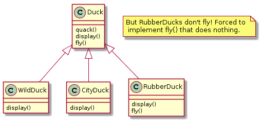
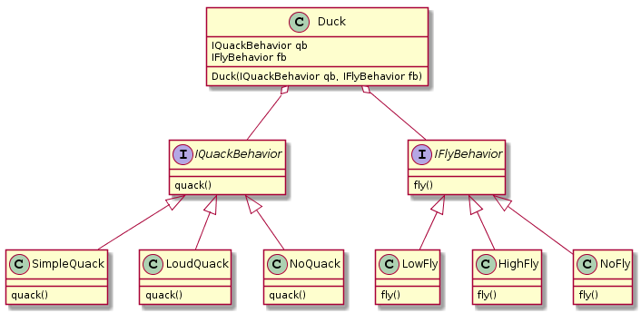
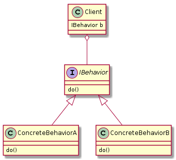
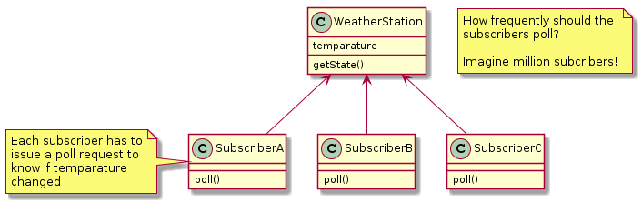

# Design Patterns

Regardless of the kind of software you develop in object oriented setting, be it a web application, android app or system software, there are some common patterns of problems that arise repeatedly. Each design pattern aims to provide a general solution to a these problems.

Design patterns can be broadly classified into three types.
  - Structural - Relates to structuring or organizing data
  - Behavioral - Relates to communication between objects 
  - Creational - Relates to object creation
  
## 1. Strategy pattern

### Type: Behavioral

### Definition (from Head First Design Patterns)
  - Stategy pattern defines a family of algorithms, encapsulates each one and makes them interchangeable.
  - Strategy lets the algorithm be very independent from the clients that use it. i.e. clients don't have to change if the algorithm changes.

### Motivating example


Things become really complicated if WildDuck shares 
  - quack behavior with MountainDuck but not with CloudDuck and 
  - display behavior with CouldDuck but not with MountainDuck.

#### Bottomline: Inheritance sucks! It works hierarchically, but not horizontally!
  - Pushing us to either duplicate the code or create intermediate classes

### Solution: Strategy pattern
#### Underlying principle: Code to an interface. 
  - Use composition over inheritance to achieve better unconstrained reusability.

#### How does it work?
  - Separate the behaviors from the Duck class: quack(), fly()
  - Define interfaces for each behavior: IQuackBehavior, IFlyBehavior
  - Define different types of behaviors by implementing the respective interfaces.
    - SimpleQuack, LoudQuack, NoQuack implement IQuackBehavior
    - LowFly, HighFly, NoFly implement IFlyBehavior
  - The client class (i.e. Duck) includes IQuackBehavior and IFlyBehavior as its attributes.
  
Now the DuckTest class can create Ducks with any combination of quack and fly behaviors.



``` java
class DuckTest {
    public static void main(String[] args) {
        Duck wildDuck = new Duck(new SimpleQuack(), new HighFly());
        Duck rubberDuck = new Duck(new NoQuack(), new NoFly());
        Duck cityDuck = new Duck(new SimpleQuack(), new LowFly());
        
        wildDuck.qb.quack();
        rubberDuck.fb.fly();
        cityDuck.qb.fly();
    }
}
```

**What did we achieve?** We removed the **quack** and **fly** behaviours (i.e. algorithms), encapuslated different types of quacking and flying in separate classes and injected them into the **Duck** class.

To summarize,


### Real-life Use case
Let's say you have list and you have a method to sort the contents of the list inbuilt in the List class. Now the sorting behavior is tightly coupled. The strategy pattern says we can decouple the 'sorting' behavior from the list implementation and move it outside and inject it to sort the list in different ways.

### Use case from Java library
Comparator from Java Collections

## 2. Observer pattern

### Type: Behavioral

### Definition (from Head First Design Patterns)
  - Observer pattern defines a one-to-many dependency between objects so that when the subject (observed object) changes state, all its dependents (observer objects) are automatically notified.
  
### Why is it needed?



Polling to check if there was change of state is not a good option since it is going to increase the communication between the subject and its observers which can turn out to be inefficient.

#### Bottomline: Polling to check for updates is inefficient.
  - Increases inter-object communication greatly

### Solution: Observer pattern
#### Underlying principle: Strive for loosely coupled designs between objects that interact. 

### How does it work

