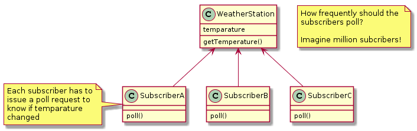
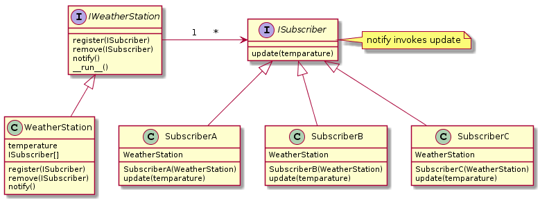
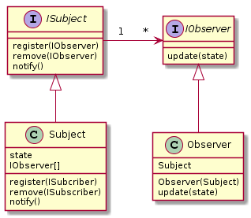

# Design Patterns

Regardless of the kind of software you develop in object oriented setting, be it a web application, android app or system software, there are some common patterns of problems that arise repeatedly. Each design pattern aims to provide a general solution to a these problems.

Design patterns can be broadly classified into three types.
  - Structural - Relates to structuring or organizing data
  - Behavioral - Relates to communication between objects 
  - Creational - Relates to object creation
  
## 1. Strategy pattern

### Type: Behavioral

### Definition (from Head First Design Patterns)
  - Stategy pattern defines a family of algorithms, encapsulates each one and makes them interchangeable.
  - Strategy lets the algorithm be very independent from the clients that use it. i.e. clients don't have to change if the algorithm changes.

### Motivating example


Things become really complicated if WildDuck shares 
  - quack behavior with MountainDuck but not with CloudDuck and 
  - display behavior with CouldDuck but not with MountainDuck.

#### Bottomline: Inheritance sucks! It works hierarchically, but not horizontally!
  - Pushing us to either duplicate the code or create intermediate classes

### Solution: Strategy pattern
#### Underlying principle: Code to an interface. 
  - Use composition over inheritance to achieve better unconstrained reusability.

#### How does it work?
  - Separate the behaviors from the Duck class: quack(), fly()
  - Define interfaces for each behavior: IQuackBehavior, IFlyBehavior
  - Define different types of behaviors by implementing the respective interfaces.
    - SimpleQuack, LoudQuack, NoQuack implement IQuackBehavior
    - LowFly, HighFly, NoFly implement IFlyBehavior
  - The client class (i.e. Duck) includes IQuackBehavior and IFlyBehavior as its attributes.
  


Now the DuckTest class can create Ducks with any combination of quack and fly behaviors.

``` java
class DuckTest {
    public static void main(String[] args) {
        Duck wildDuck = new Duck(new SimpleQuack(), new HighFly());
        Duck rubberDuck = new Duck(new NoQuack(), new NoFly());
        Duck cityDuck = new Duck(new SimpleQuack(), new LowFly());
        
        wildDuck.qb.quack();
        rubberDuck.fb.fly();
        cityDuck.qb.fly();
    }
}
```

**What did we achieve?** We removed the **quack** and **fly** behaviours (i.e. algorithms), encapuslated different types of quacking and flying in separate classes and injected them into the **Duck** class.

To summarize,


### Real-life Use case
Let's say you have list and you have a method to sort the contents of the list inbuilt in the List class. Now the sorting behavior is tightly coupled. The strategy pattern says we can decouple the 'sorting' behavior from the list implementation and move it outside and inject it to sort the list in different ways.

### Use case from Java library
Comparator from Java Collections

## 2. Observer pattern

### Type: Behavioral

### Definition (from Head First Design Patterns)
  - Observer pattern defines a one-to-many dependency between objects so that when the subject (observed object) changes state, all its dependents (observer objects) are automatically notified.
  
### Motivating example



Polling too frequently increases communication but state may not have changed. Polling at longer time intervals causes the subscriber to lose state changes. How do the subscribers know when exactly to poll?

In the presence of million subscribers (imagine distributed systems scenario), polling results in lots of unwanted traffic causing serious inefficiencies.

#### Bottomline: Polling sucks! It is clearly inefficient.
  - Increases inter-object communication most of which can be avoided.

### Solution: Observer pattern

#### Terms
  - The 'one' observed class is referred to as **Subject**, **Publisher**, or **Observable**.
  - The 'many' subscriber classes are referred to as **Observer**s.
  
#### Underlying principle: Strive for loosely coupled designs between objects that interact. 
  - Adopt a 'push' based approach to send the updates

### How does it work?
  - Define IWeatherStation interface that specifies register, remove and notify behaviors.
  - Implement WeatherStation 
  - Define ISubscriber interface that specifies update behavior. This will be invoked by WeatherStation's notify.
  - We could move the register, remove and update behavior to ISubject (and make it abstract class instead of interface).
  - The getTemparature function is retained allowing the observers to get the temparature, if they want to.
  - We assume WeatherStation is like a server which runs forever when started until it is stopped. It also has sensors to sense the temperature and calls notify automatically from the __run__ method.



Now WeatherDriver class can be implemented as follows:

``` java
class WeatherDriver {
    public static void main(String[] args) {
        WeatherStation ws = new WeatherStation();
        SubscriberA sa = new SubscriberA(ws);
        SubscriberB sb = new SubscriberB(ws);
        
        ws.register(sa);
        ws.register(sb);
    }
}
```
To summarize,


### What did we achieve?
By implementing a 'push' based strategy, we prevented tonnes of potential redundant communication between the observable and many observers.

### Use cases
  - YouTube subscription
  - Distributed computing
  
### Knotty issue
Note that Observer has an instance of Subject in its definition. This implies Observer and Subject share 'has-a' relationship (although it is not explicitly shown in the diagram). This is required because the Observer may want to remove itself from the subscription in future and therefore store it as a instance variable. So, Subject is not really a part Observer in true sense.

Accoriding to Rober Martin, Observer pattern violates Single Responsibility Principle. You can refer to a discussion on this topic in [Stack Overflow](https://stackoverflow.com/questions/28281853/does-the-observer-pattern-violate-single-responsibiliy-principle).

### Observer Pattern in Java

[Java's Observer pattern](https://www.baeldung.com/java-observer-pattern) explained with an example. There are umpteen resources out there in the web.

## 3. Decorator pattern

### Type: Structural

### Definition (from Head First Design Patterns)
  - The Decorator Pattern attaches additional responsibilities to an object dynamically.
  - Decorators provide a flexible alternative to subclassing for extending functionality.
  
### Motivating example
Two types of basic beverages: DeCaf and Espresso. A customer may order them as they are or may want to add one or more condiments to them. Each condiments comes with additional cost. It is possible to define a separate class for each combination of condiments. This can lead to class explosion. Check Page 81 of Head First Design Patterns.

Another approach would be to introduce the condiments as part of Beverage (abstract) class (shownn below). 


This can also lead to a problem where a particular flavour don't apply for a beverage that extends Beverage. Example is Tea - mocha may not be added to tea. Implying that we are going against Interface Seggregation Principle.

The customer may want double mocha which is not possible.

#### Bottomline: Composing required and optional behaviors in a single class sucks!

### Solution: Decorator pattern

#### Underlying principle: Dynamically add new behavior to an object
  - Follow open/closed principle - open for extension and closed for modification 

### How does it work?
  - Implement condiments that share both **is-a** and **has-a** relationship with beverage.
  - Has-a relationship is used to access the basic behavior.
  - Is-a relationship is used to incorporate additional behavior.


Now BeverageTest class can be implemented as follows:

``` java
class BeverageTest {
    public static void main(String[] args) {

    }
}
```
To summarize,


### What did we achieve?
By using 'Decorator' pattern, we achieved the flexibility to dynamically add responsibilities to any object without having to meddle with the object in any way.

### Use cases
  - Input and Output stream classes in Java's I/O package.
  - Basic text data which can be encrypted with one or more encryption algorithms in any order.
  
### Observer Pattern in Java

[Java's I/O Streams]() explained with an example. 

